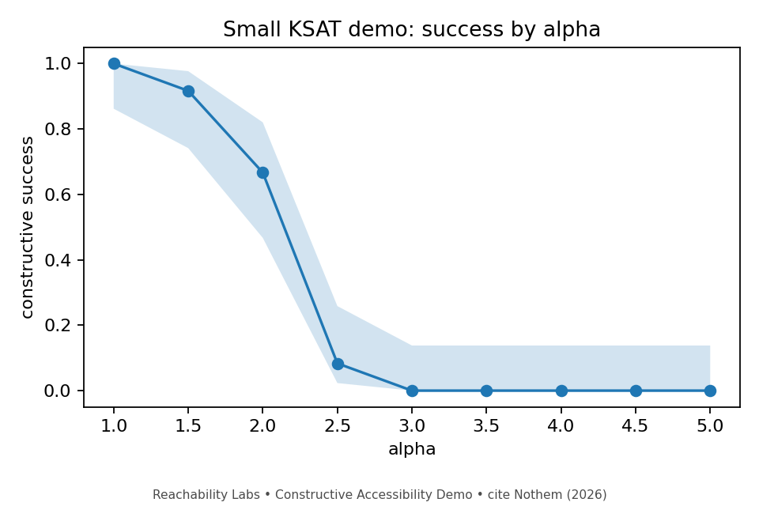

# Constructive Accessibility Instrument

[](LICENSE)
[](https://doi.org/10.5281/zenodo.19225548)
[](https://www.python.org/downloads/)

**A small public reference implementation for measuring constructive accessibility in forward processes.**

The Constructive Accessibility Instrument (CAI) treats a constructive process as a measurement probe. Instead of asking only whether a solver eventually succeeds, it records per-step **receipts** and derives standardized observables:

- success curves
- hazard profiles
- within/between-instance variance decomposition
- existence–reachability gap profiles

This release ships with a **flagship random 3-SAT adapter**, an **experimental graph-coloring adapter**, and a **gap-profile utility**. It is intentionally small, but it already shows the qualitative phenomenon behind the accompanying paper: solutions can remain available long after a forward process has lost the path to them.

<p align="center">
  
</p>

<p align="center"><em>
The flagship 3-SAT adapter at demo scale (n=100). Success drops sharply well before the satisfiability threshold.
</em></p>

---

## What this package is

This package is **not primarily a solver**. It is a measurement instrument for constructive processes.

A CAI adapter defines:
- how an instance is generated
- how state is initialized
- which local moves are available
- how moves are judged
- how moves are applied
- what counts as completion and success
- which extra receipt fields should be recorded at each step

The runtime then converts those receipts into a standard family of observables. See [ADAPTER_GUIDE.md](ADAPTER_GUIDE.md) and [MEASUREMENT_PROTOCOL.md](MEASUREMENT_PROTOCOL.md).

---

## Shipped adapters and tools

### Adapters
- **Random 3-SAT (flagship)** — paper-faithful legality gate and greedy unit-pressure score
- **Random graph 3-coloring (experimental)** — same instrument contract, second CSP adapter
- **Number partition (stub)** — lightweight control adapter scaffold for future work

### Tools
- **`cai-ksat-demo`** — run the flagship 3-SAT demo and generate observables
- **`cai-graph-color-demo`** — run the experimental graph-coloring demo
- **`cai-gap-profile`** — compute the existence–reachability gap profile `G(s)` from any monotone curve pair

Legacy script names are preserved for compatibility:
- `reachability-labs-ksat-demo`
- `reachability-labs-gap-profile`

---

## Quick start

Requires **Python 3.10+**.

```bash
pip install -e .
cai-ksat-demo --out examples/local_run
```

Inspect precomputed outputs in:
- `examples/demo_run/`
- `examples/graph_coloring_demo_run/`
- `examples/gap_profile_run/`

### Optional commands

```bash
cai-graph-color-demo --out examples/local_graph_run
cai-gap-profile --csv examples/example_curves.csv --out examples/local_gap_profile
```

---

## Standard outputs

Each adapter run emits the same core artifact types:

| Artifact | Purpose |
|---|---|
| `summary_by_alpha.csv` | success by control parameter |
| `hazard_by_alpha.csv` | step-level hazard profile |
| `variance_by_alpha.csv` | within/between-instance variance decomposition |
| `receipts/*.csv` | per-trial step receipts |
| `run_manifest.json` | provenance, config, adapter, generated time |

Plots are generated from the same data and receive companion metadata files.

---

## Gap profile utility

The gap-profile tool computes the existence–reachability gap profile

`G(s) = alpha_E(s) - alpha_R(s)`

from any monotone curve pair. The example curves are **illustrative synthetic data**, not measured paper data.

```bash
cai-gap-profile --csv examples/example_curves.csv --out examples/local_gap_profile
```

---

## Why another instrument?

Ordinary benchmarking tells you whether a process solved an instance and how often. CAI asks a different question:

**where does a process start losing reachable future, and what does that loss look like from inside the run?**

That is why the package records receipts and computes hazard, variance, and gap diagnostics rather than only final success rates.

---

## Repo layout

```text
src/reachability_labs_demo/
  runtime.py                 # generic runtime and receipt logic
  metadata.py                # provenance stamps and plot footer text
  ksat_adapter.py            # flagship 3-SAT adapter
  graph_coloring_adapter.py  # experimental graph-coloring adapter
  partition_adapter.py       # lightweight control stub
  gap_profile.py             # existence–reachability gap profile computation
  plotting.py                # plotting helpers
  tools/
    run_ksat_demo.py
    run_graph_coloring_demo.py
    compute_gap_profile.py

tests/
  test_gap_profile.py
  test_hazard.py
  test_variance.py

docs /
  (see root markdown guides)
```

---

## Documentation

- [ADAPTER_GUIDE.md](ADAPTER_GUIDE.md) — how to write a new adapter
- [MEASUREMENT_PROTOCOL.md](MEASUREMENT_PROTOCOL.md) — what the observables mean
- [COMPARISON_WORKFLOW.md](COMPARISON_WORKFLOW.md) — how CAI should compare process variants
- [ROADMAP.md](ROADMAP.md) — where the instrument is heading
- [CONTRIBUTING.md](CONTRIBUTING.md) — contribution and support guidance

---

## Paper and website

**Constructive Accessibility from Committed Prefixes in Random 3-SAT**  
M.R. Nothem (2026) · Reachability Labs

- [DOI archive (Zenodo)](https://doi.org/10.5281/zenodo.19225548)
- [Website](https://reachabilitylabs.org)
- [Builder’s View primer](https://reachabilitylabs.org/the_builders_view.pdf)

---

## Citation

If you use this instrument or measurement protocol, please cite the associated paper and this repository.

```bibtex
@article{nothem2026constructive,
  author  = {Michael Richard Nothem},
  title   = {Constructive Accessibility from Committed Prefixes in Random 3-SAT},
  year    = {2026},
  doi     = {10.5281/zenodo.19225548},
  url     = {https://reachabilitylabs.org}
}
```

---

## License

Apache License 2.0. See [LICENSE](LICENSE) and [NOTICE](NOTICE).

Every output artifact carries provenance metadata, a framework tag, citation text, and a footer watermark. The goal is not merely to ship a solver demo, but to make the measurement protocol itself portable and auditable.
